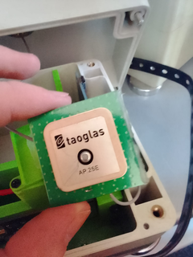

# Sine-Wave Decomposition Compression

Lossy compression using sine-wave (Fourier) decomposition.
This Project consists of a Python Playground, aswell as a stand alone C-Library to add to your own project or play around with.

## Table of Contents

- [The basic idea](#the-basic-idea)
- [Image encoding example](#image-encoding-example)
- [PPG example](#ppg-example)
- [Python playground overview](#python-playground-overview)
- [C library](#c-library)

## The basic idea

Almost any repeating or quasi-repeating signal - a heartbeat, a song,
an engine's vibration, .... - can be described as a sum of sine waves of different
frequencies, amplitudes, and phases. Aka. A Fourier series. The useful
trick for compression is that **most of a signal's "shape" usually comes from
just a handful of the biggest sine waves**, not all of them.

So instead of storing every raw sample, we can:

1. Run an FFT on a chunk of the signal to find its sine-wave components.
2. Keep only the *N* strongest components of a signal. (by amplitude)
3. Store just those *N* components (frequency, amplitude, phase) instead of
   every sample.
4. To play it back, just add those *N* sine waves together again.

What we get is a Lossy Compression.: throwing away the small, less important components
loses some detail, but keeping the most important components.

## Image encoding example

Small Example of treating a Image as layers of 1-D Signals, visualizing compression loss (visible artifacts).

| Original | Reconstructed |
|:---:|:---:|
|  |  |

Parameters:
```
chunk_size=250
target_accuracy=0.97
max_components=35
achieved R^2=0.9789
1843200 -> 66702 bytes (27.63x)
```

## PPG example (A more data driven look)

Applied here to one 16-second chunk of real PPG data: noisy raw signal filtered down to the heartbeat band, then rebuilt from the sin wave decomposition:


A real recording isn't perfectly stationary - heart rate drifts, someone
starts walking, a bit of motion noise shows up. If you try to fit *one* set
of sine waves across an entire minutes long recording, you will end up with a 
very bad approximation of the actual wave form.

The fix is simple: **cut the recording into short chunks** (16 seconds here)
and re-run the encoder independently on each one. Every chunk gets its own
freshly fitted set of sine waves, so local changes in behavior (a burst of
motion, a shift in heart rate) only affect that chunk's component count, not
the whole file. It also means noisier/busier chunks can automatically use
more components while calm chunks use fewer, which keeps overall accuracy
consistent instead of being dragged down by the hardest part of the
recording. You can see that adaptivity directly below - component count
spikes exactly where the signal gets harder, while accuracy stays pinned
near the target across all chunks:


Stitching every chunk's reconstruction back together and laying it over the
real signal shows the same story at the whole-file level:


On the ~62-minute test recording used here, this reaches roughly **69x
compression** while keeping every chunk at 98%+ reconstruction accuracy.

## Python playground overview
`image_encode.py`    - Play Around with image encoding and decoding. (dependent of C-Library, )  

What it does:
- see "C library" below  
  
`ppg_sine_encode.py` - Play Around with ppg encoding and decoding.  

What it does:
- Loads a chunk of PPG data, optionally adds synthetic noise to stress-test.
- Bandpass-filters each chunk to the physiological heartbeat band, dropping
  baseline drift and high-frequency noise before compression even starts.
- Dynamically picks the smallest number of sine-wave components needed to
  hit a target reconstruction accuracy (Aka. R²) per chunk.
- Quantizes those components down to a few bytes each.
- Produces the plots above: a close-up of one example chunk, accuracy/
  compression stats across every chunk, and a whole-file overlay of the real
  vs. reconstructed signal.

This is the sandbox for answering questions like "how few components can we
get away with", "how does chunk length affect accuracy", or "how does this
hold up under noise" - before committing to a fixed, efficient
implementation (or just to play around with it).

## C library

The C side (`FFT/*`, `sin_wave_encoder/*`, `swi_defines.h`) is implements the same encoding/decoding logic as shown above and can be included as a stand alone lib in any other project, or just be used for faster computation.

- `FFT/*` - Fast Fourier Transform dependencies (Ported from ArduinoFFT).
- `sin_wave_encoder/*` - Actual Sin Wave Decompositon library.
- `swi_defines.h` - Library specific defines to tweak.
- `main.c` - an example of how to use the library.

How to try it out: 

1. Build the C-Library with `make`.
2. Execute `image_encode.py` - a Python script to play around with encoding
images specifically, calling the compiled `swe` binary under
the hood (see [Image encoding example](#image-encoding-example) above).
